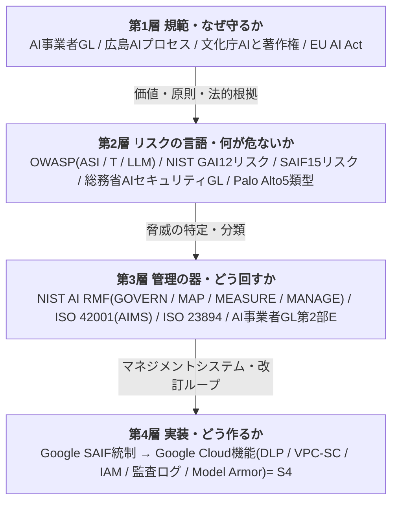

# 外部基準 横断比較表(framework-comparison)

S1で読み込んだ外部基準を1枚で見渡す対照表。**S3で社内ルールを書くときの根拠早見表**であり、**外販で「主要基準に準拠」を示す証拠**でもある。
各基準の詳細は [sources/](../sources/index.md) の要約に、本プロジェクトの統制は [docs/to-be/](to-be/index.md) にある。

> 凡例: 🇯🇵国内規範 / 🌐中立標準 / 🏛️国際標準(政府・ISO) / 🏢ベンダー枠組み / 📋実適用事例。⚠ベンダー資料・規格プレビューは出所の留保つき。

______________________________________________________________________

## 0. 全体像 — 基準を4層で捉える

読んだ基準は役割が違う。「上位の規範」から「下位の実装」へ降りる4層で整理すると重複なく使える。

- **本プロジェクトの設計**: 第1層で価値(P原則)、第2層でリスク台帳(A-2)、第3層で改訂ループ・運用、第4層でS4技術実装。各層を別々の基準で裏付ける。
- **中立性の担保**: 規範・分類の根拠は中立標準(OWASP/NIST/ISO)に置く。ベンダー枠組み(SAIF/Palo Alto)は実装・裏取りに使う。

______________________________________________________________________

## 1. 基準ロスター(読了一覧)

| 基準 | 層 | 区分 | 本プロジェクトでの主な用途 |
|---|---|---|---|
| [AI事業者ガイドライン 1.2版](../sources/2026-03-31_meti-soumu_ai-business-guideline_v1.2_main.md) | 1・3 | 🇯🇵国内規範 | 上位規範。P原則の母体、第2部E=改訂ループ、別添2A=利用指針の型、別添7C=アセスメント様式 |
| [広島AIプロセス(指針・行動規範)](../sources/2023-10-30_g7_hiroshima-ai-process_international-code-of-conduct_ja.md) | 1 | 🇯🇵🌐規範 | 提供者・開発者立場の行動規範(外販・自社エージェント) |
| [文化庁 AIと著作権](../sources/2024-03-15_bunkacho_ai-and-copyright-approach.md) | 1 | 🇯🇵法解釈 | 起点③の本命。依拠性3類型・2段階判定・規範的行為主体責任 |
| [総務省 AIセキュリティ技術GL](../sources/2026-03_soumu_ai-security-technical-measures-guideline_main.md) | 2・4 | 🇯🇵政府技術 | 起点①②の技術根拠。LLM層脅威・RAGアクセス制御・営業秘密フック。⚠エージェント対象外 |
| [OWASP ASI Top 10](../sources/2025-12_owasp_top10-for-agentic-applications-2026.md) | 2 | 🌐中立標準 | リスク台帳の一次分類。Least-Agency。付録A=ASI↔T↔LLM対応行列 |
| [OWASP Agentic T&M v1.1](../sources/2025-12_owasp_agentic-ai-threats-and-mitigations_v1.1.md) | 2 | 🌐中立標準 | 台帳の細目(T1-17)+6プレイブック+意思決定ツリー |
| [OWASP LLM Top 10 2025](../sources/2024-11_owasp_top10-for-llm-applications-2025.md) | 2 | 🌐中立標準 | 台帳のLLM単体層。LLM07/08が新規 |
| [NIST AI RMF Playbook](../sources/2023-01_nist_ai-rmf-1.0-playbook.md) | 3 | 🏛️国際標準 | 4機能の実装ガイド。γ自己評価設問。リスク≈影響度×発生可能性 |
| [NIST 生成AIプロファイル(AI 600-1)](../sources/2024-07_nist_ai-rmf-generative-ai-profile_ai-600-1.md) | 2・3 | 🏛️国際標準 | GAI12リスク+アクションID付き推奨アクション+コンテンツ来歴 |
| [ISO/IEC 42001 AIMS(KPMG解説)](../sources/2025-05_kpmg_iso-iec-42001-aims-certification-overview.md) | 3 | 🏢🏛️ベンダー解説 | 認証可能なAIMS。SoA=全リスク→統制目標。⚠規格本文は有償未取得 |
| [ISO/IEC 23894 リスク管理(プレビュー)](../sources/2023-02_iso-iec-23894-ai-risk-management-guidance_preview.md) | 3 | 🏛️国際標準 | AIリスク管理の作法。8原則。⚠附属書A/B(目的・リスク源)は有償未取得 |
| [Google SAIF](../sources/2025_google-saif-secure-ai-framework_web.md) | 4 | 🏢ベンダー | Gemini実装ブリッジ。リスク15×統制25。エージェント3統制。リスク自己評価ツール |
| [Palo Alto/Idira Securing Agentic AI](../sources/2026-04_paloalto-idira_securing-agentic-ai-identity-foundation.md) | 2・4 | 🏢ベンダー | エージェント新リスク5類型・統制4領域。⚠OWASPで裏取り済 |
| [AIGA 攻めのAIガバナンス](../sources/2025-11-28_aiga_offensive-ai-governance-strategy-report_v1.0.md) | 1 | 民間提言 | 経営層向け意思決定フレーム。攻めのガバナンス・自社棚卸し |
| [サンノゼ市 AI RMF 自己評価](../sources/2024_san-jose_ai-rmf-self-assessment.md) | — | 📋実適用事例 | As-Is棚卸しの方法論・成熟度1〜4テンプレ |
| [G7 中小企業AI導入ツールキット](../sources/2025-07-24_g7-canada_sme-ai-adoption-toolkit_with-haip-principles.md) | 1 | 🌐国際 | 外販の課題セグメント・広島指針12項目の原文 |

______________________________________________________________________

## 2. ★ リスク・タクソノミ横断表

脅威を「テーマ」で束ね、各基準の対応コードを引く。**リスク台帳([A-2](to-be/01-risk-classification-and-grading.md))の一次分類=OWASP ASI、細目=T、従属=その他**、の対応関係の早見表。空欄=その基準に明示の対応項目なし(またはカバー外)。

| # | リスクテーマ | OWASP ASI | OWASP T | OWASP LLM | NIST GAI | SAIF | 総務省/PaloAlto | 起点 |
|---|---|---|---|---|---|---|---|---|
| 1 | プロンプトインジェクション(直接/間接) | ASI01 | T6 | LLM01 | 9情報SEC | PIJ | PI直接/間接 | ①②③ |
| 2 | 機密データ漏えい(出力・クエリ経由) | ASI06 | T1 | LLM02 | 4プライバシー | SDD | 無記録持出 | ① |
| 3 | RAG/ベクトル汚染・クロステナント漏出 | ASI06 | T1 | LLM08 | 8情報完全性 | DP/SDD | 汚染伝播 | ① |
| 4 | データ・モデルポイズニング | ASI06 | T1 | LLM04 | 8情報完全性 | DP/MST | データポイズニング | ①③ |
| 5 | 権限昇格・過剰権限/過剰エージェンシー | ASI03 | T3 | LLM06 | — | IIC | 権限昇格 | ①② |
| 6 | ツール悪用・意図せぬRCE | ASI05 | T2/T11 | LLM05 | 9情報SEC | IIC/IMO | — | ① |
| 7 | エージェント暴走(Rogue)・逸脱/欺瞞 | ASI09/ASI10 | T7/T13 | LLM06 | 7人間-AI | RA | — | ②③ |
| 8 | なりすまし・ID偽装 | ASI03 | T9 | — | — | (アクセス制御) | なりすまし | ①② |
| 9 | サプライチェーン汚染 | — | T17 | LLM03 | 12バリューチェーン | MST/IIC | 連鎖脆弱性 | ①③ |
| 10 | 監査ログ・否認・追跡不能(起点②) | ASI08 | T8 | — | (説明責任) | (エージェント可観測性) | — | ② |
| 11 | リソース枯渇・DoS・コスト枯渇 | — | T4 | LLM10 | — | DMS | DoS | ② |
| 12 | 誤情報・ハルシネーション・作話 | ASI09 | T5 | LLM09 | 2作話/8完全性 | IMO | — | ②③ |
| 13 | 著作権・知財・無許諾学習データ | — | — | (LLM02) | 10知財 | UTD | 文化庁(依拠性) | ③ |
| 14 | システムプロンプト漏えい | — | — | LLM07 | — | (入出力検証) | — | ①② |
| 15 | バイアス・公平性・均質化 | — | — | — | 6有害バイアス | (敵対的テスト) | ISO TR24027 | ③ |
| 16 | 人間操作・HITL過負荷 | ASI09 | T10/T15 | — | 7人間-AI | RA | — | ② |
| 17 | モデル窃取・抽出 | — | — | (LLM10) | — | MXF/MRE | モデル抽出 | ① |
| 18 | 過剰データ取扱い(プライバシー) | — | — | LLM02 | 4プライバシー | EDH | — | ① |
| 19 | 危険用途(CBRN/暴力/わいせつ) | — | — | — | 1/3/11 | — | — | 用途(F11) |
| 20 | マルチエージェント連鎖・通信汚染 | ASI08 | T12/T14 | — | — | — | 連鎖脆弱性 | ②③ |
| 21 | 環境影響(計算資源) | — | — | — | 5環境 | — | — | (対象外) |

> 注: OWASP ASIコードは確証のある対応のみ記載(付録Aのマッピング行列が一次根拠)。「( )」は間接対応・統制側での言及。空欄はその基準の明示スコープ外。**起点列が示すとおり、起点①②③に全テーマが収束する=スコープの妥当性確認**。

______________________________________________________________________

## 3. ガバナンス・サイクルの対応(第3層)

「継続改善サイクル」を4基準が別の語彙で同じことを言っている。**改訂ループ・[P8](to-be/00-principles-and-scope.md)の多重裏付け**。

| 段階 | AI事業者GL 第2部E | NIST AI RMF | ISO 23894 | ISO 42001(AIMS) | SAIF |
|---|---|---|---|---|---|
| 方針・統治 | 環境整備(方針策定) | **GOVERN(統治)** | 原則 + 枠組み(リーダーシップ) | AIMS方針(計画) | ガバナンス統制群 |
| リスク特定 | リスクの特定・分析 | **MAP(文脈把握)** | プロセス:スコープ・文脈・特定 | AIリスク評価+AIインパクト評価 | SAIFマップ(リスク配置) |
| 測定・評価 | (リスク分析) | **MEASURE(測定)** | プロセス:分析・評価 | パフォーマンス評価 | リスク自己評価ツール |
| 対応・運用 | リスクへの対応 | **MANAGE(管理)** | プロセス:リスク対応・監視 | 運用・SoA統制実装 | 統制実装 + 保証統制群 |
| 改善・改訂 | 評価・見直し | (横断・継続) | 改善(適応・継続改善) | 是正・継続改善 | 脆弱性管理・脅威検知 |

______________________________________________________________________

## 4. 起点3点 × 各基準(根拠の束ね)

各起点を主張するとき、どの基準を根拠に引けるか。

| | 起点① 機密データフィルタリング | 起点② 監査ログ監視 | 起点③ 生成物の法的適合性 |
|---|---|---|---|
| **国内規範** | AI事業者GL(データ管理)/個情法 | AI事業者GL(アカウンタビリティ・監査ログ条項) | 文化庁AIと著作権/景表法・薬機法 |
| **総務省技術GL** | RAGアクセス制御・機密分離(別添)・営業秘密フック | トレーサビリティ=起点②の直接根拠 | — |
| **OWASP** | ASI06/T1-3/LLM02/LLM08 | T8(否認)/ASI08/PB1 | ASI09/T5・T15/LLM09 |
| **NIST** | GAI4(プライバシー)/GAI9 | MG-4.x(監視)/MG-4.3(インシデント記録) | GAI2(作話)/GAI8/GAI10(知財)/コンテンツ来歴 |
| **ISO** | 42001データ保護/27001 ISMS整合 | 23894(全ライフサイクル記録保持) | TR24027(バイアス)/TR24368(倫理) |
| **SAIF** | DP/SDD/MXF + データ統制群 | エージェント可観測性 + 保証統制群 | UTD/IMO + 出力検証 |
| **うちの統制** | [B-1](to-be/03-three-pillars-to-be.md) | [B-2](to-be/03-three-pillars-to-be.md) | [B-3](to-be/03-three-pillars-to-be.md) |

______________________________________________________________________

## 5. P原則(8原則)× 基準の根拠

[00の8原則](to-be/00-principles-and-scope.md)が、どの基準に支えられているか。

| P原則 | 主な根拠基準 |
|---|---|
| P1 人間中心 | AI事業者GL共通指針/広島指針/NIST(人間-AI構成)/SAIF(エージェント行動への承認) |
| P2 合法性・権利尊重 | 文化庁/個情法/不競法/NIST GAI10(知財)/EU AI Act |
| P3 安全性・セキュリティ | 総務省技術GL/OWASP全般/SAIF/ISO 27001 |
| P4 透明性・追跡可能性 | AI事業者GL(アカウンタビリティ)/OWASP T8/NIST(可観測性)/SAIF(エージェント可観測性) |
| P5 最小権限・最小エージェンシー | OWASP ASI(最小エージェンシー)/SAIF(エージェント権限)/Palo Alto |
| P6 セキュア・バイ・デザイン(Secure by Design) | 総務省技術GL/SAIF(セキュア・バイ・デフォルトのML基盤)/NIST GOVERN1.2 |
| P7 公平性・品質 | AI事業者GL共通指針/NIST GAI6(バイアス)/ISO TR24027/文化庁(品質) |
| P8 アジャイル・ガバナンス | AI事業者GL第2部E/NIST(4機能)/ISO 23894(8原則)/ISO 42001(PDCAサイクル) |

______________________________________________________________________

## 6. この表の使い方

- **S3(社内ルール策定)**: 各ルール条文に「根拠基準」を脚注で付けるとき、§2〜§5から引く。「なぜこの禁止事項か」を国内GL+中立標準+ベンダーの三層で示せると説得力が出る。
- **外販テンプレート**: §1ロスターと§2横断表を顧客に見せ、「当社の枠組みは主要基準(国内GL/NIST/ISO/OWASP/SAIF)を網羅している」ことの証拠にする。別添7Cの「対応箇所」列にこの対応コードを使う。
- **リスク台帳([A-2](to-be/01-risk-classification-and-grading.md))**: §2横断表が台帳の従属マッピングの実体。新規ユースケースのリスク抽出時、OWASP意思決定ツリーで該当テーマを特定→この表で各基準の対応を一括取得。
- **抜け漏れ点検**: §2の起点列が全テーマを①②③(+用途・対象外)に収束させている=スコープの妥当性チェック。新リスクがどこにも入らなければスコープ見直しのトリガー。

______________________________________________________________________

## 7. カバレッジの限界(正直な注記)

- **規格本文の未取得**: ISO 42001・23894の核(SoA詳細・附属書A目的/B リスク源)は有償で未取得。認証を本気で狙うS4段階で取得判断。
- **ベンダー資料の留保**: SAIF・Palo Altoはベンダー製。規範の根拠は中立標準に置き、実装手引きとして使う。
- **未読の補完候補**: MITRE ATLAS(攻撃戦術)/Google Cloud機能詳細(S4で深掘り)/ISO 27090・27091/AIVSS(定量スコア)。改訂ループS4の監視対象。
- **本表は生きた文書**: 基準改訂・新規読込のたびに更新する(版管理はgit履歴で代替)。

## 関連

- 各基準の詳細要約: [sources/index.md](../sources/index.md)
- 本プロジェクトの統制: [docs/to-be/index.md](to-be/index.md)
- ロードマップ S1: [roadmap.md](../roadmap.md)
