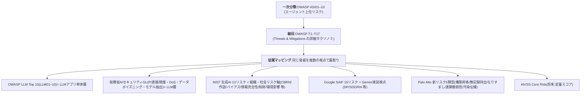

# 01. リスク分類・格付け基準(To-Be)

全ルールの背骨。「どのAI利用が、どのデータで、どこまで自律的に、何に作用するか」をリスクで格付けし、
**禁止 / 承認制 / 自由利用**の3区分に振り分ける基準を定める。02の利用指針・禁止事項はこの基準から導出される。

______________________________________________________________________

## 1. ユースケースのリスク格付け基準

### 判断軸(4軸)

リスクレベルは次の4軸の組み合わせで決まる。1つでも高ければ全体が引き上がる(最大値方式)。

| 軸 | 低 | 中 | 高 |
|---|---|---|---|
| **① データ機密度**(→後掲マトリクス) | 公開情報 | 社内情報 | 機密・最機密(個人情報/営業秘密/顧客提供データ) |
| **② 自律度**(Least-Agency) | 助言・要約のみ | 下書き生成(人間が採否) | ツール自動実行・多段エージェント |
| **③ 対外性** | 社内利用のみ | 社内意思決定に影響 | 対外発信・顧客への提供 |
| **④ 可逆性** | いつでも取り消せる | 手戻り可能 | 不可逆(送金・本番変更・公開・データ削除) |

> EU AI Actのリスク階層(許容不可/高/限定/最小)と総務省GLのリスクベース2軸(影響の大きさ×発生可能性)を、自社運用に合わせて4軸へ具体化。
> この「リスク≈影響度×発生可能性」と段階スケールの考え方は、[NIST AI RMF Playbook GOVERN 1.3](../../sources/2023-01_nist_ai-rmf-1.0-playbook.md)(risk≈impact×likelihood、RAG=赤黄緑スケール、全モデルにリスクレベルを付与)でも国際的に支持される。

### 利用リスク3区分(格付け結果の振り分け先)

| 区分 | 定義 | 例 | 統制 |
|---|---|---|---|
| **🔴 禁止** | リスクが許容できない、または法令・契約違反となる利用 | 最機密データの未承認外部AIへの入力/無レビュー生成物の対外発信/本番への自動コミット | 一律不可。技術的にも遮断 |
| **🟡 承認制** | 中〜高リスクだが統制下で許容できる利用 | 顧客データを使う社内分析/自律ツール実行を伴うエージェント/対外発信物の生成 | β承認+γ記録。別添7Cで1ケース1枚アセスメント |
| **🟢 自由利用** | 低リスクで日常的に使ってよい利用 | 公開情報の要約・調査/社内文書のドラフト下書き(人間レビュー前提) | 事前承認不要。基本指針の遵守のみ |

### 格付けの運用

- 新規ユースケースは **ユースケース申請・審査フロー**(→[04](04-operational-flows.md))に乗せ、4軸で格付け→区分判定。
- **④可逆性が「不可逆」または②自律度が「自動実行」なら、最低でも承認制 + HITL必須**(→[03](03-three-pillars-to-be.md) プロンプト監査ログ監視フロー)。

______________________________________________________________________

## 2. リスク台帳の分類体系(確定)

脅威の分類は中立標準2本を背骨にした二層構造に確定。新規リスクはこの体系に位置づけて登録する。

- 二層+従属で同じ脅威を複数視点から裏取りできる:LLM単体=[OWASP LLM Top10](../../sources/2024-11_owasp_top10-for-llm-applications-2025.md)+総務省GL、エージェント=ASI×T、組織・社会軸=[NIST生成AI12リスク](../../sources/2024-07_nist_ai-rmf-generative-ai-profile_ai-600-1.md)、Gemini実装=[SAIF15リスク](../../sources/2025_google-saif-secure-ai-framework_web.md)。
- **テーマ別の全基準対応は[framework-comparison.md §2](../framework-comparison.md)の横断表が実体**(21テーマ × 各基準コード)。本台帳の従属マッピングはそこへリンクする運用。
- 各ユースケースの該当リスクは、[T&M要約](../../sources/2025-12_owasp_agentic-ai-threats-and-mitigations_v1.1.md)の**意思決定ツリー6ステップ**(自律手順/記憶/ツール/認証/人間/マルチ)で機械的に抽出する。
- 根拠:[ASI付録A](../../sources/2025-12_owasp_top10-for-agentic-applications-2026.md)のマッピング行列。
- **将来の発展**: 本台帳は[ISO/IEC 42001のSoA(適用宣言書=全AIリスクを統制目標に紐づけ)](../../sources/2025-05_kpmg_iso-iec-42001-aims-certification-overview.md)に昇格できる粒度で設計する。認証を狙う段階で台帳→SoAへ展開。

______________________________________________________________________

## 3. データ機密区分 × AI利用可否マトリクス

入力してよいデータと使ってよいAIの組み合わせを定義する。起点①の運用基準。

### データ機密区分(4段)

| 区分 | 内容 | 法的フック |
|---|---|---|
| **公開** | 既に公開済み・公開予定の情報 | — |
| **社内** | 一般的な社内情報(非機密の業務情報) | — |
| **機密** | 未公開の事業情報・社内限定の営業/技術情報 | 不競法 営業秘密(秘密管理性) |
| **最機密** | 個人情報/顧客から預かったデータ/NDA対象/法令で保護される情報 | 個情法・契約・各法令 |

> 「機密」へのセキュリティ対策は、不正競争防止法の**営業秘密の秘密管理性要件の充足を基礎づける有利な一要素**になる(ただし対策の有無で要件が判断されるわけではない=断定しない。[パブコメ補正](../../sources/2026-03_soumu_ai-security-technical-measures-guideline_public-comments.md))。

### 利用可否マトリクス(To-Be)

| データ\\AI | 🟢 社内Gemini(統制下) | 🟡 承認済外部AI(契約・オプトアウト確認済) | 🔴 未承認の外部AI |
|---|---|---|---|
| 公開 | 可 | 可 | 可(ただし出力は要検証) |
| 社内 | 可 | 承認制 | 不可 |
| 機密 | 承認制(RAGアクセス制御下) | 原則不可(個別承認のみ) | 禁止 |
| 最機密 | 承認制(最小権限・監査ログ必須) | 禁止 | 禁止 |

- 外部AIは**学習利用オプトアウト・データレジデンシー・契約上の機密保持**を確認できたものだけを「承認済」とする(→C-5 ベンダー評価)。
- 社内Geminiでも、機密・最機密は\*\*RAGのアクセス制御(タグ付け/マルチテナント/最小権限)\*\*でユーザ権限を超える参照を防ぐ([総務省GL別添](../../sources/2026-03_soumu_ai-security-technical-measures-guideline_attachment.md))。

______________________________________________________________________

## 関連

- 前: [00 基本原則・適用対象](00-principles-and-scope.md)
- 次: [02 AI利用指針・禁止事項](02-acceptable-use-and-prohibitions.md)(本基準から導出)
- リスク台帳の横断対応表: [framework-comparison.md §2](../framework-comparison.md)
- 実装テンプレ: [別添7Cワークシート](../../sources/2026-03-31_meti-soumu_ai-business-guideline_v1.2_worksheet.md)
