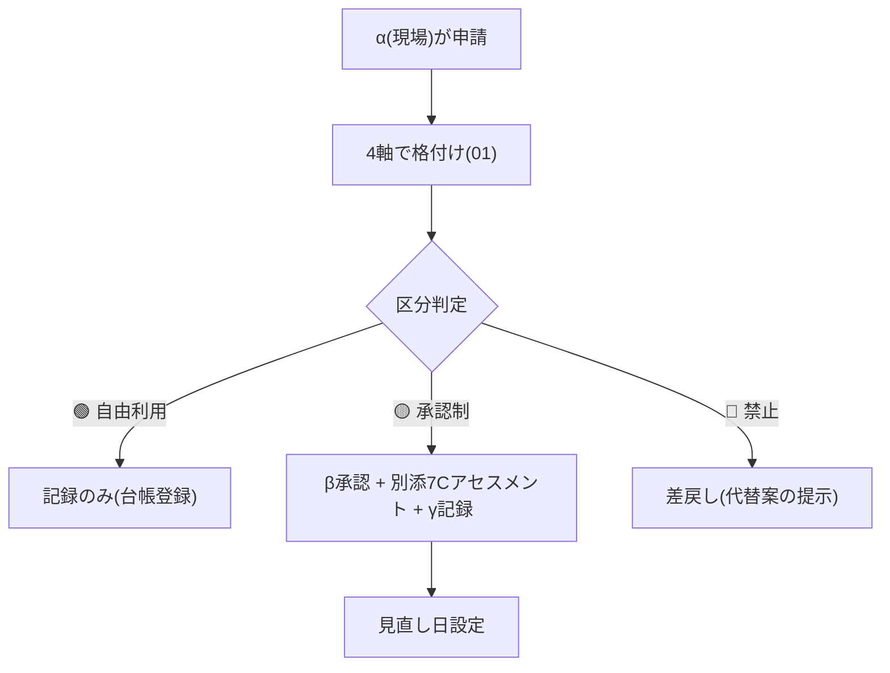
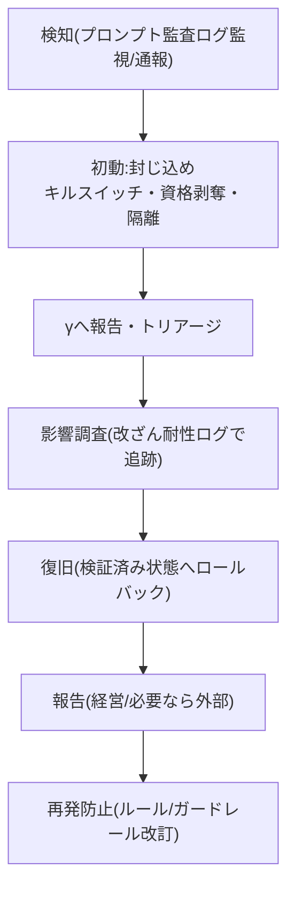

# 04. 運用フロー・体制のTo-Be

指針・禁止事項を「回す」ための運用フロー。誰が・いつ・どう判断するかを定める。

______________________________________________________________________

## 1. ユースケース申請・審査・棚卸しフロー

新しいAI利用を統制下に置く入口。

- **アセスメント**: 別添7C(分類/設問/対応箇所=ASI×T/検討対象か/連携/具体的アプローチ/見直し日+役割αβγ)。対応箇所列にはNIST GV/MP/MS/MG番号・SAIF統制も併記できる(→[framework-comparison.md](../framework-comparison.md))。
- **棚卸し**: 全AIユースケースを台帳管理。四半期ごとに棚卸し(改訂ループ)。シャドーAIの発見も兼ねる。
- **公開アルゴリズム登録簿(将来)**: 公衆・顧客に影響する承認済AIは、台帳の対外公開版として開示する案([サンノゼ市の Public Algorithm Register](../../sources/2024_san-jose_ai-rmf-self-assessment.md))。公共系・対外サービス顧客向けの外販で訴求点になる。

## 2. Human-in-the-Loop(HITL)必須操作の定義

次は**人間の承認なしにAIに実行させない**(F7の具体化)。

- **不可逆操作**: 送金・決済、本番環境変更、データ削除、公開・対外送信。
- **重要判断**: 決裁、顧客への確約、契約・法的判断、人事評価。
- **設計原則**: 高影響操作はdry-run/差分プレビューを人間に提示してから承認(ASI02)。HITL過負荷(T10)を避け、承認の質を保つ(過剰な承認要求で判断疲労を起こさせない)。

## 3. インシデント対応プレイブック

AI起因事故の検知〜報告〜再発防止。

- 接続: 別添2A 3-4-2(事故対応)。エージェントは隔離後の再統合に再アテステーション+人間承認([T&M](../../sources/2025-12_owasp_agentic-ai-threats-and-mitigations_v1.1.md))。
- **外部報告**: 「報告」段階は経営に加え、法規制に沿った当局への報告を含む([NIST MG-4.3](../../sources/2024-07_nist_ai-rmf-generative-ai-profile_ai-600-1.md):個情法漏えい報告等)。インシデント開示はNISTが生成AIの主要考慮事項の一つに据える。
- **記録**: エラー・ニアミス・負の影響を**台帳(DB)化**(報告日/件数/影響評価/対応)。システム変更履歴・版管理メタデータも保持([NIST MG-4.x](../../sources/2024-07_nist_ai-rmf-generative-ai-profile_ai-600-1.md))。
- 親PJ F2要求の「事故対応方針の明文化」に対応。

## 4. シャドーAI / シャドーIT対策

未承認AIの業務利用を可視化・抑止(基本指針6/F6)。

- プロキシ/CASBログで未承認AIサービス利用を検知。
- 「勝手にインフラ・エージェントを構築しない」を制度化(体制草案p.9)。
- 承認済AIの選択肢を十分に用意し、シャドー化の動機を減らす(禁止だけにしない)。

## 5. ベンダー/モデル評価基準

外部AI・モデルを「承認済」にする条件([データ機密区分マトリクス](01-risk-classification-and-grading.md)の入口)。

- **必須確認**: 学習利用オプトアウト/データレジデンシー/契約上の機密保持/SLA・サポート。
- **セキュリティ**: モデルカード・システムカード、第三者評価、サプライチェーン(SBOM/AIBOM)、**統制保証報告(SSAE)**([NIST 第三者考慮](../../sources/2024-07_nist_ai-rmf-generative-ai-profile_ai-600-1.md))。
- **契約上の論点**: **継続学習が契約義務・保証に与える影響**、テスト・学習データの**所有権・利用権**を契約スコープで精査([ISO/IEC 23894 5.4.1](../../sources/2023-02_iso-iec-23894-ai-risk-management-guidance_preview.md))。Gemini調達・外販契約のレビュー項目に。
- **立場別**: 利用者として評価(広島AIプロセス国際行動規範=ベンダー評価の観点)。

## 6. 教育・リテラシー

- 全員: 基本指針10ヶ条+データ区分+禁止事項の必修(研修Lv.1のリスク講座に接続、体制草案p.10)。
- α/β: 申請・承認・アセスメントの実務研修。
- 擬人化・説明捏造(ASI09)への注意=AIの自信ありげな説明を疑う訓練。

## 7. γによる自己評価(成熟度・As-Is)

統制が「ある」だけでなく「機能しているか」を定期点検する。

- **自己評価設問**: [NIST AI RMF Playbook](../../sources/2023-01_nist_ai-rmf-1.0-playbook.md)各サブカテゴリの「文書化すべき自己質問」を内部点検チェックリストに転用(γが実施)。
- **成熟度採点**: 各統制を**成熟度1〜4**(未着手/計画中/確立/革新)で採点+根拠+伸ばす点+裏付けリンク([サンノゼ市方式](../../sources/2024_san-jose_ai-rmf-self-assessment.md)。xlsxテンプレ流用)。四半期ごとに再採点しスコア推移を改訂ループのKPIにする。
- **Gemini前提の補助**: [SAIF リスク自己評価ツール](../../sources/2025_google-saif-secure-ai-framework_web.md)(利用者向け12設問)を社内Gemini導入のAs-Isチェックに併用。
- **着手条件**: 体制(誰がγか)確定後に開始。方法論・テンプレは入手済(→S0 As-Is)。

______________________________________________________________________

## 役割(αβγ・別添7C準拠)

| 役割 | 担い手 | 責務 |
|---|---|---|
| **α 利用判断者** | 現場 | 申請・適正利用・出力検証 |
| **β 承認・管理者** | 各部門長/PJオーナー | 承認制案件の承認・HITLゲート |
| **γ 統制・監査** | 内部統制分科会/BSM室 | 基準策定・監視・インシデント統括・改訂・**自己評価(成熟度採点)** |

## 関連

- 格付け: [01](01-risk-classification-and-grading.md)/ 指針・禁止: [02](02-acceptable-use-and-prohibitions.md)/ 起点3点: [03](03-three-pillars-to-be.md)
- 対策・自己評価の根拠: [framework-comparison.md](../framework-comparison.md)/ [NIST Playbook](../../sources/2023-01_nist_ai-rmf-1.0-playbook.md)/ [サンノゼ市自己評価](../../sources/2024_san-jose_ai-rmf-self-assessment.md)/ [SAIF](../../sources/2025_google-saif-secure-ai-framework_web.md)
- 改訂ループ: ロードマップ「改訂ガバナンス・ループ」(四半期レビュー/トリガーレビュー/版管理)
