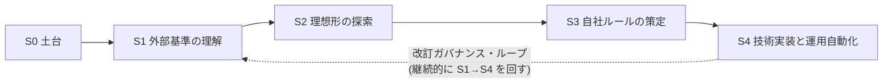

# AIガバナンス・リスク・内部統制・セキュリティ ロードマップ

| 項目               | 内容                                                                                                                    |
| ------------------ | ----------------------------------------------------------------------------------------------------------------------- |
| 担当               | AIタスクフォース「内部統制」分科会(リスク・内部統制・セキュリティ)                                                      |
| 親PJ               | AI活用支援の事業化タスクフォース(e-Agency / クライアントゼロ → 外販パッケージ化)                                        |
| 公式スコープ       | ①機密データフィルタリング ②プロンプト監査ログの監視フロー ③AI生成物の著作権・法的適合性確認(体制草案 p.6-7「内部統制」) |
| 親PJマイルストーン | フェーズ2「ガバナンス策定」(2026/6–7):利用指針(禁止事項)・法規制照合・事故対応方針の明文化                              |
| 関連資料           | [体制草案要約](sources/2026-04-30_ai-taskforce-charter-and-org-design_draft.md) / [sources索引](sources/index.md)       |
| 最終更新           | 2026-06-14                                                                                                              |

> **基本思想**: 上位(方針)から下位(技術)へ降りる。監視項目を作る前に「何を守り、誰が判断するか」を先に決める。成果物は最初から **社内版** と **外販テンプレート版** の二形態を意識する(販売戦略/外販分科会との接続点)。

______________________________________________________________________

## 全体像:5ステージ



ユーザー提示の4段階(S1〜S4)に、土台づくり(S0)と継続改訂ループを追加した構成。

______________________________________________________________________

## S0. 土台づくり(基盤整備)〔追加〕

外部調査の前に、判断の足場を固める。S1と並行で軽く着手してよい。

- **ナレッジベースの運用ルール確定**: `sources/` に「要約MD + 原典」をペア保管、出典・該当ページを必ず明記(本リポジトリで運用中)。
- **用語集(Glossary)の起票**: AI/AIシステム/AIサービス/エージェント/グラウンディング/ハルシネーション 等を社内定義で統一(AI事業者ガイドラインの定義に揃える)。
- **ステークホルダーとRACIの確認**: スポンサー・PJオーナー・アドバイザー・各分科会・管理部/BSM室の責任分界(体制草案 p.3/p.14 を基に)。
- **現状把握(As-Is)**: 既存のセキュリティ規程・情報管理規程・就業規則のAI関連条項、既に動いている案件(日経・サポート等)のデータ取り扱い実態を棚卸し。

**完了条件**: 用語集v0・RACI表・As-Is棚卸しメモが `docs/` に存在する。

> **現状(2026-06-13)**: ナレッジ運用ルール ✅運用中 / 用語集 ✅`docs/glossary.md` 作成済 / RACI表 ⏸️体制未確定で保留 / As-Is棚卸し ⏸️体制確定・既存規程の提供待ち(ただし\*\*[サンノゼ市事例](sources/2024_san-jose_ai-rmf-self-assessment.md)で成熟度1〜4採点の方法論・xlsxテンプレを入手済\*\*=体制が固まれば即着手できる)。**S0は3/4が完了、残り2件は体制依存で着手不可**。

______________________________________________________________________

## S1. 外部基準・指針の理解(国内外)

公開ガイドラインを **ユーザーが1件ずつ添付 → 構造化要約を `sources/` に蓄積**。各要約に「自社への適用示唆」「起点3点との関連」を必ず付す。

### 読み込み対象リスト(チェックリスト)

**国内**

- [x] AI事業者ガイドライン 第1.2版(総務省・経産省, 2026-03-31)/ 別添・チェックリスト
- [x] 広島AIプロセス 包括的政策枠組み(全AI関係者向け国際指針 / 高度AI開発組織向け国際行動規範)
- [ ] 個人情報保護委員会の生成AI関連注意喚起・ガイドライン
- [x] 著作権法とAI(文化庁「AIと著作権に関する考え方」)
- [ ] 必要に応じ:金融・広告など業界別の指針(顧客業界に応じて)
- [x] 〔追加読込〕総務省 AIセキュリティ技術対策GL(本体・別添・パブコメ)/ Palo Alto-Idira エージェントID基盤 / AIGA 攻撃的AIガバナンス / G7 SME向けAI導入ツールキット

**国際・標準**

- [x] NIST AI RMF 1.0(Govern / Map / Measure / Manage)+ Generative AI Profile(※Playbook=4機能の詳細 + 生成AIプロファイル AI 600-1、いずれも読込済。コア文書 AI 100-1 は補足候補)
- [△] ISO/IEC 42001(AIマネジメントシステム)/ ISO/IEC 23894(AIリスク管理)(※42001はKPMG解説で概観、23894はプレビュー(原則・枠組み)取得済。両規格本文の有償部分・23894附属書は未取得)
- [ ] EU AI Act(リスク分類・禁止用途・GPAI義務)— 外販で海外/グローバル企業を想定する場合
- [ ] OECD AI原則

**技術・脅威カタログ(S4の伏線)**

- [x] Google SAIF(Secure AI Framework)— Gemini Enterprise前提で最重要(※Web巡回で取得。リスク15×統制25、エージェント3統制、自己評価ツール)
- [x] OWASP Top 10 for LLM Applications / OWASP Agentic AI threats(※LLM Top10 2025 + Agentic 2本=ASI Top10 + T&M v1.1、いずれも読込済)
- [ ] MITRE ATLAS(AI/MLへの攻撃戦術・技術)
- [ ] Google Cloud のセキュリティ/コンプライアンス機能(IAM, VPC-SC, DLP API, Cloud Audit Logs, Context-Aware Access 等)

**完了条件**: 上記のうち国内必須+標準2件(NIST/ISO)+SAIFの要約が `sources/` に揃い、各要約に「適用示唆」欄が記入済み。

**成果物**: `sources/*.md`(各基準の要約)、`docs/framework-comparison.md`(横断比較表)〔追加:複数基準を1枚で見渡す対照表〕。✅**両方とも作成済**(横断比較表は2026-06-14完成)。

> **現状(2026-06-13)**: ★**S1完了条件をほぼ達成**。国内必須(AI事業者GL・広島・文化庁)+エージェント脅威カタログ(OWASP ASI/T&M)+OWASP LLM Top10+**NIST AI RMF(Playbook+生成AIプロファイル)**+**ISO(42001概観+23894プレビュー)**+**Google SAIF**、すべて読込済で各要約に適用示唆を記入済。サンノゼ市の自己評価実例も取得。⚠未取得は規格本文の有償部分(ISO 42001/23894核)・MITRE ATLAS・Google Cloud機能詳細(S4で深掘り)。**残るは成果物=横断比較表 `docs/framework-comparison.md` の作成のみ**(標準が出そろい着手条件が完全に整った)。

______________________________________________________________________

## S2. 理想形の探索(業界標準・最新事例の調査)

起点3点を中心に「あるべき姿(To-Be)」を、調査で裏付けながら描く。社内の制約はまだ考えない。

### 起点3点 × 探索の論点

1. **機密データフィルタリング**
   - 入出力DLP、PII/顧客機密の検知・マスキング、データレジデンシー、学習利用オプトアウト、RAGコネクタ経由の権限昇格防止。
   - 調査: SAIF/DLP APIのベストプラクティス、同業他社のデータ境界設計事例。
2. **プロンプト監査ログの監視フロー**
   - 誰が・いつ・何を入力し・何が返り・どのツールを実行したか。改ざん耐性・保持期間・検知→エスカレーション→対応の運用フロー。
   - 調査: AI Observability の標準項目、J-SOX/内部統制の証跡要件、SIEM連携事例。
3. **AI生成物の著作権・法的適合性確認**
   - 生成物のライセンス汚染(特にコード)、対外発信物の人間レビュー必須化、著作権・契約・景表法等の適合チェックフロー。
   - 調査: 文化庁の考え方、企業の生成物レビュー運用、コード生成のライセンススキャン事例。

### 横断的に描くべき To-Be 〔追加〕

- **AIユースケース分類・リスク格付け基準**(禁止 / 承認制 / 自由利用)
- **ユースケース申請・審査・棚卸しフロー**(誰が承認するか)
- **Human-in-the-loop必須操作の定義**(決裁・送金・顧客送信・本番変更など)
- **インシデント対応プレイブック**(AI起因事故の検知〜報告〜再発防止)
- **シャドーAI/シャドーIT対策**(体制草案 p.9「勝手にインフラ構築しない」の制度化)
- **ベンダー/モデル評価基準**(Gemini/3rdパーティモデルの選定・契約チェック)
- **教育・リテラシー**(研修Lv.1のリスク講座を体系に接続:体制草案 p.10)

**完了条件**: 起点3点+横断テーマごとに「理想形(To-Be)」と根拠(出典)が `docs/to-be/` に整理されている。

**成果物**: `docs/to-be/*.md`、`docs/risk-taxonomy_ideal.md`(理想のリスク分類)。

> **現状(2026-06-14)**: `docs/to-be/` に00〜04+索引が揃い、起点3点+横断7テーマすべてTo-Be記述済 ✅。**S1で読んだ全基準(国内GL/OWASP/NIST/ISO/SAIF/総務省)をTo-Be本文へ統合完了**し、横断対応は[framework-comparison.md](docs/framework-comparison.md)に集約。**S2はほぼ完了**。`docs/risk-taxonomy_ideal.md` は独立ファイル未作成だが、内容は[01のリスク台帳分類体系](docs/to-be/01-risk-classification-and-grading.md)に記述済=独立ファイル化するかは任意。**残るは6本の最終レビュー・確定(線引きの詰め)と、体制確定後のS3着手**。

______________________________________________________________________

## S3. 自社ルールの策定(落とし所の見極め)

理想形(S2)と自社の実態(S0のAs-Is)・リソース・親PJスケジュールを突き合わせ、**実行可能な落とし所**を確定。Must/Should/Laterで段階適用する。

### 策定する文書群(= 親PJフェーズ2「ガバナンス策定」の納品物)

- **AI利用ポリシー(基本方針)** — 経営の意思表示、適用範囲、原則
- **AI利用指針・禁止事項** ★親PJで明文化が求められている中核
- **リスク分類・ユースケース承認基準**(禁止/承認制/自由利用)
- **データ取り扱いルール**(機密区分別の可否、外部送信ルール)
- **AI生成物の取り扱い・レビュー規程**(著作権・対外発信)
- **インシデント対応手順**(事故対応方針の明文化)
- **法規制照合表**(自社利用と各基準・法令の対応マトリクス)
- **役割・責任規程(RACI)正式版**

### 進め方の原則 〔追加〕

- **二形態同時設計**: 各文書に「社内適用版」と「外販テンプレート版(顧客が穴埋めできる雛形)」を意識。
- **段階適用**: 全社一斉でなく、先行分科会(日経・サポート等)で試行→横展開。
- **承認プロセス**: ドラフト → アドバイザー(野口・田中)レビュー → スポンサー承認、の経路を明記。

**完了条件**: 上記文書のv1がアドバイザーレビューを経てスポンサー承認され、社内公開されている。

**成果物**: `docs/policies/*.md`(社内版)、`templates/*.md`(外販版)。

______________________________________________________________________

## S4. 技術実装と運用自動化(ガードレール&ハーネス)

S3で決めたルールを **システムで強制・記録・検知** する。参照アーキは体制草案 p.11(Agent Registry / AI Security / Access Authorization / AI Observability / Agent Gateway)。ルールを SAIF / Google Cloud 実機能へマッピングして実装。

### 実装テーマ(ルール → 技術統制のマッピング)

- **アイデンティティ・権限**: GCP IAM最小権限、エージェント用SA棚卸し、Context-Aware Access、ツール実行権限(書込み/外部送信)の制御。
- **データ保護(ガードレール)**: DLP API による入出力フィルタ、VPC-SC によるデータ境界、PII検知・マスキング。
- **監査・可観測性**: Cloud Audit Logs/プロンプトログの集約 → ダッシュボード → アラート(検知ルール)。改ざん耐性のある保管。
- **出力ガードレール**: グラウンディング強制、生成物のライセンス/コンプライアンススキャン、Human-in-the-loop ゲート。
- **エージェント防御**: プロンプトインジェクション対策、ツール連鎖の境界、Agent Registry での棚卸し。
- **シャドーAI検知**: プロキシ/CASBログ、未承認サービス利用の可視化。

### 運用自動化(改訂・反映のループ)★ユーザー指定の重点

- **ポリシー → 設定のコード化**: ガードレール設定を IaC / Policy as Code 化(設定ドリフトの検知)。
- **改訂ワークフロー**: 外部基準の更新(S1の定期再読込)→ 影響評価 → ルール改訂 → 設定反映 → 周知、を半自動化。
- **継続監視ツール**: ログ集約・KPI・違反検知の内製ダッシュボード(本リポジトリで開発)。
- **メトリクス/KPI**: ポリシー遵守率、検知件数、レビュー通過率、インシデント件数・MTTR 等。

**完了条件**: 主要ガードレールが本番適用され、監視ダッシュボードが稼働、改訂ループの手順が文書+一部自動化されている。

**成果物**: 監視ツール一式、`docs/runbook/*.md`、IaC/Policy as Code リポジトリ。

______________________________________________________________________

## 改訂ガバナンス・ループ(継続)〔追加〕

「作って終わり」にしないための定常運用。

- **定期レビュー**: 四半期ごとに S1(新基準・法改正)を再読込し、ルールとガードレールへ反映。
- **トリガーレビュー**: 重大インシデント・新技術(新モデル/新エージェント機能)・新規外販案件の発生時に随時。
- **版管理**: 全ポリシー文書に版番号・改訂履歴・次回レビュー日を付与。

______________________________________________________________________

## マイルストーン目安(親PJスケジュールに整合)

| 時期      | 親PJフェーズ      | 本チームの主成果                                                                 |
| --------- | ----------------- | -------------------------------------------------------------------------------- |
| 2026/6    | F1→F2             | S0完了、S1着手(国内基準の読込)、用語集・RACI                                     |
| 2026/7    | F2 ガバナンス策定 | S1主要分+S2理想形、**S3でAI利用指針・禁止事項・事故対応方針 v1**(親PJ要求の納品) |
| 2026/8–12 | F3 PoC            | S3残文書の確定、S4ガードレール/監視の試作・PoC適用                               |
| 2027/1–3  | F4 事業化         | S4本番適用+運用自動化、外販テンプレート版の完成                                  |

> S3の中核文書(利用指針・禁止事項・事故対応)は親PJのF2(7月)に間に合わせる必要があるため、S1/S2を全部完璧に終えてからS3へ進むのではなく、**起点3点に絞って S1→S2→S3 を先行縦断**し、残りは並行で深掘りする運用が現実的。

______________________________________________________________________

## ディレクトリ構成(予定)

```
ai-governance/
├── roadmap.md                ← 本書
├── journal.md                ← 開発日記(ブログ用一次記録)
├── sources/                  ← S1: 外部基準の原典+構造化要約
│   └── index.md
├── docs/
│   ├── glossary.md           ← S0
│   ├── framework-comparison.md ← S1横断比較
│   ├── to-be/                ← S2 理想形
│   ├── policies/             ← S3 社内版ルール
│   └── runbook/              ← S4 運用手順
├── templates/                ← S3 外販テンプレート版
└── (tools/)                  ← S4 監視・自動化ツール
```
